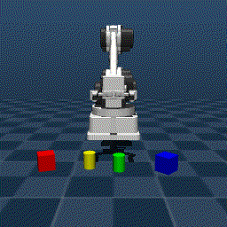
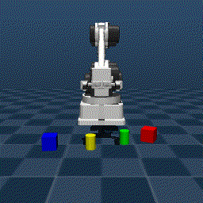
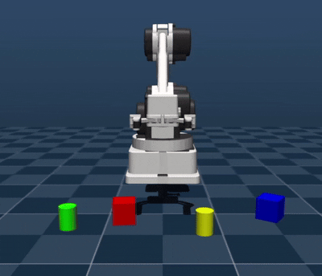
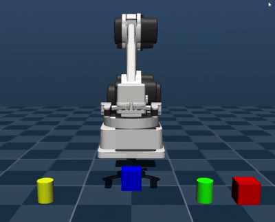

# RaccoonBot OpenVLA Pipeline Cube Push Task

## 1. Project Overview

본 프로젝트는 기존 RaccoonBot OpenVLA pipeline을 확장하여, 기존 colored cylinder grasp task뿐만 아니라 cube object와 cube push task를 추가한 과제이다.

기존 예제는 `"grasp the red cylinder"`와 같은 cylinder grasp instruction만 지원하였다. 본 과제에서는 MuJoCo scene에 cube object를 추가하고, grasp task와 push task를 모두 포함하는 multi-object, multi-task dataset을 구성하였다.

## 2. Main Contribution

본 프로젝트의 주요 변경점은 다음과 같다.

- MuJoCo scene에 cube object 추가
- 기존 cylinder grasp task를 cube grasp task까지 확장
- cube push task 추가
- 4-object scene 구성
- RLDS / TFDS dataset 재구축
- OpenVLA LoRA fine-tuning 수행
- push inference 안정화를 위한 client-side action 보정 추가

## 3. Task Setup

최종 active object는 다음 4개로 구성하였다.

- green cylinder
- yellow cylinder
- red cube
- blue cube

최종 dataset은 다음 6개 task-target 조합으로 구성하였다.

| Task | Target | Episodes |
|---|---|---:|
| grasp | green cylinder | 50 |
| grasp | yellow cylinder | 50 |
| grasp | red cube | 50 |
| grasp | blue cube | 50 |
| push | red cube | 50 |
| push | blue cube | 50 |
| Total |  | 300 |

Cylinder push도 실험하였으나, cylinder는 굴림 및 접촉 특성이 불안정하여 안정적인 push demonstration을 확보하기 어려웠다. 따라서 최종 dataset에서는 push task를 cube object로 제한하였다.

## 4. New / Edited Files

| File | Description |
|---|---|
| `Mujoco/Raccoon_colored_cylinder_cube.xml` | cylinder와 cube가 포함되도록 수정한 MuJoCo scene |
| `Mujoco/raccoon_grasp_push_4objects_alltargets_dataset_fixed.py` | grasp/push demonstration dataset 생성 코드 |
| `local_client/openvla_grasp_push_4objects_custom_client_focus_pushboost.py` | grasp/push inference를 위한 수정 client |
| `logs/finetune_grasp_push_300ep_10000step_b2_ga8.log` | OpenVLA LoRA fine-tuning log |


## 5. Before / After Evidence

본 과제에서는 기존 RaccoonBot OpenVLA pipeline과 비교하여 dataset 구성과 inference 동작을 다음과 같이 확장하였다.

### 5.1 Dataset Extension

| Item                 | Before                       | After                                                   |
| -------------------- | ---------------------------- | ------------------------------------------------------- |
| Object type          | Colored cylinder only        | Green/yellow cylinder + red/blue cube                   |
| Task type            | Grasp only                   | Grasp + cube push                                       |
| Language instruction | `grasp the {color} cylinder` | `grasp the {color} {shape}`, `push the {color} {shape}` |
| Active scene         | Colored cylinders            | 4-object scene: 2 cylinders + 2 cubes                   |
| Dataset size         | Original grasp dataset       | 300 successful demonstrations                           |
| Final task set       | Cylinder grasp               | 4 grasp tasks + 2 cube push tasks                       |

최종 dataset은 다음 6개 task-target 조합으로 구성하였다.

| Task  | Target          | Episodes |
| ----- | --------------- | -------- |
| grasp | green cylinder  | 50       |
| grasp | yellow cylinder | 50       |
| grasp | red cube        | 50       |
| grasp | blue cube       | 50       |
| push  | red cube        | 50       |
| push  | blue cube       | 50       |
| Total |                 | 300      |

Cylinder push도 추가로 실험하였지만, 원통형 물체는 굴림과 접촉 특성이 불안정하여 안정적인 push demonstration을 확보하기 어려웠다. 따라서 최종 dataset에서는 push task를 red/blue cube로 제한하였다.

### 5.2 Code Improvement

| Item               | Before                            | After                                                                      |
| ------------------ | --------------------------------- | -------------------------------------------------------------------------- |
| Dataset generation | Cylinder grasp demonstration only | Multi-object grasp + cube push demonstration generation                    |
| MuJoCo scene       | Cylinder objects only             | Cylinder + cube objects                                                    |
| Client inference   | Grasp-oriented client             | Grasp/push task selection with `task_type`, `target_color`, `target_shape` |
| Push execution     | Not supported in original task    | Push target placement stabilization and push action boost                  |
| Debugging          | Basic execution output            | Action log and push-related execution log added                            |

### 5.3 Visual Evidence

에피소드 시각화는 저장된 `frame_*.png` 이미지들을 GIF 파일로 변환하여 생성하였다.

* Grasp 예시: 로봇이 목표 물체로 이동한 뒤 그리퍼를 닫아 물체를 집는 동작을 수행한다.
* Push 예시: 로봇이 그리퍼를 열린 상태로 유지한 채 엔드이펙터를 낮추고 전진하여 큐브를 밀어낸다.

GIF 결과를 통해 생성된 demonstration이 의도한 grasp 및 push 동작을 정상적으로 수행하는 것을 확인할 수 있다.

### 5.4 Training Evidence

새롭게 생성한 `raccoon_pick_place` 데이터셋을 사용하여 OpenVLA LoRA 파인튜닝을 수행하였으며, 총 10,000 step까지 학습이 정상적으로 완료되었다.

```text
Max step 10000 reached.
Saved Model Checkpoint for Step 10000.
```

위 로그는 학습이 중단 없이 완료되었고, 최종 10,000 step 시점의 모델 체크포인트가 저장되었음을 의미한다.

학습 로그 파일은 다음 경로에 포함되어 있다.

```text
logs/finetune_grasp_push_300ep_10000step_b2_ga8.log
```


## 6. Execution Pipeline

본 프로젝트는 다음 순서로 진행하였다.

1. Raw MuJoCo demonstration dataset 생성
2. Raw dataset을 RLDS intermediate format으로 변환
3. TFDS dataset build
4. OpenVLA LoRA fine-tuning
5. OpenVLA inference server 실행
6. Local MuJoCo client를 통해 grasp/push task 실행

---

### 6.1 Raw Demonstration Dataset Generation

먼저 MuJoCo 환경에서 RaccoonBot demonstration episode를 생성하였다.

```bash
cd /data/Raccoonbot_Openvla/Mujoco

python raccoon_grasp_push_4objects_alltargets_dataset_fixed.py
```

생성된 raw dataset은 다음 경로에 저장된다.

```text
/data/Raccoonbot_Openvla/Mujoco/raccoon_grasp_push_4objects_custom
```

최종 dataset은 총 300개의 successful episode로 구성하였다.

```text
grasp the green cylinder : 50 episodes
grasp the yellow cylinder: 50 episodes
grasp the red cube       : 50 episodes
grasp the blue cube      : 50 episodes
push the red cube        : 50 episodes
push the blue cube       : 50 episodes
```

각 episode folder는 다음 정보를 포함한다.

```text
frame_*.png
meta.json
robot state
end-effector pose
object pose
action sequence
success flag
```

---

### 6.2 Convert Raw Dataset to RLDS Intermediate Format

OpenVLA fine-tuning에 사용하기 위해 raw MuJoCo episode를 RLDS intermediate format으로 변환하였다.

```bash
cd /data/Raccoonbot_Openvla/Mujoco/raccoon_dataset

rm -rf /data/Raccoonbot_Openvla/Mujoco/raccoon_dataset/openvla_rlds_intermediate

python convert_raw_to_openvla_rlds_intermediate.py \
  --raw_root /data/Raccoonbot_Openvla/Mujoco/raccoon_grasp_push_4objects_custom \
  --out_root /data/Raccoonbot_Openvla/Mujoco/raccoon_dataset/openvla_rlds_intermediate \
  --val_ratio 0.1
```

이 과정에서 raw episode가 train / validation split으로 나뉘고, OpenVLA dataset builder에서 사용할 수 있는 intermediate data로 변환된다.

출력 경로는 다음과 같다.

```text
/data/Raccoonbot_Openvla/Mujoco/raccoon_dataset/openvla_rlds_intermediate
```

---

### 6.3 Build TFDS Dataset

RLDS intermediate data를 기반으로 OpenVLA fine-tuning에 필요한 TFDS dataset을 build하였다.

```bash
cd /data/Raccoonbot_Openvla/Mujoco/rlds_dataset_builder/raccoon_pick_place

tfds build --overwrite
```

`tfds build`가 완료되면 기본적으로 `/root/tensorflow_datasets` 아래에 dataset이 생성된다.
이후 OpenVLA fine-tuning script가 읽을 수 있도록 project directory로 이동하였다.

```bash
rm -rf /data/Raccoonbot_Openvla/tensorflow_datasets

mv /root/tensorflow_datasets /data/Raccoonbot_Openvla/
```

최종 dataset 경로는 다음과 같다.

```text
/data/Raccoonbot_Openvla/tensorflow_datasets
```

---

### 6.4 OpenVLA LoRA Fine-Tuning

TFDS dataset을 이용하여 `openvla/openvla-7b` base model을 LoRA 방식으로 fine-tuning하였다.

Fine-tuning configuration은 다음과 같다.

| Item                        | Value                |
| --------------------------- | -------------------- |
| Base model                  | `openvla/openvla-7b` |
| Dataset                     | `raccoon_pick_place` |
| LoRA rank                   | 16                   |
| Batch size                  | 2                    |
| Gradient accumulation steps | 8                    |
| Effective batch size        | 16                   |
| Learning rate               | 5e-4                 |
| Max steps                   | 10,000               |
| Save steps                  | 1,000                |

Fine-tuning command는 다음과 같다.

```bash
cd /data/Raccoonbot_Openvla/openvla

export PYTHONPATH=/data/Raccoonbot_Openvla/openvla:$PYTHONPATH

PYTORCH_CUDA_ALLOC_CONF=max_split_size_mb:128 \
WANDB_MODE=disabled CUDA_VISIBLE_DEVICES=0 \
torchrun --standalone --nnodes 1 --nproc-per-node 1 vla-scripts/finetune.py \
  --vla_path openvla/openvla-7b \
  --data_root_dir /data/Raccoonbot_Openvla/tensorflow_datasets \
  --dataset_name raccoon_pick_place \
  --run_root_dir /data/Raccoonbot_Openvla/openvla/openvla-runs \
  --adapter_tmp_dir /data/Raccoonbot_Openvla/openvla/openvla-adapter-tmp \
  --lora_rank 16 \
  --batch_size 2 \
  --grad_accumulation_steps 8 \
  --learning_rate 5e-4 \
  --max_steps 10000 \
  --save_steps 1000 \
  --run_id_note raccoon-grasp-push-300ep-10000step-b2-ga8-r16 \
  2>&1 | tee /data/Raccoonbot_Openvla/openvla/logs/finetune_grasp_push_300ep_10000step_b2_ga8.log
```

Fine-tuning은 10,000 step까지 수행되었으며, 최종 checkpoint가 저장되었다.

---

### 6.5 Run OpenVLA Inference Server

Fine-tuned checkpoint를 사용하여 OpenVLA inference server를 실행하였다.

```bash
cd /data/Raccoonbot_Openvla/openvla

CUDA_VISIBLE_DEVICES=0 python openvla_server.py \
  --model_path /data/Raccoonbot_Openvla/openvla/openvla-runs/openvla-7b+raccoon_pick_place+b16+lr-0.0005+lora-r16+dropout-0.0--raccoon-grasp-push-300ep-10000step-b2-ga8-r16--image_aug \
  --default-unnorm-key raccoon_pick_place \
  --host 0.0.0.0 \
  --port 8001 \
  --device cuda
```

`--default-unnorm-key raccoon_pick_place`는 RaccoonBot dataset의 action normalization statistics를 사용하기 위해 지정하였다.

---

### 6.6 SSH Tunnel for Local Client

서버의 OpenVLA inference server와 local MuJoCo client를 연결하기 위해 SSH tunnel을 사용하였다.

Local PC terminal에서 다음 명령어를 실행하였다.

```bash
ssh -L 8001:127.0.0.1:8001 root@qlak315.iptime.org -p 11120
```

이 tunnel을 유지한 상태에서 local client는 다음 server URL로 접속한다.

```text
http://127.0.0.1:8001
```

---

### 6.7 Run Local MuJoCo Client

Local MuJoCo client를 실행하여 fine-tuned OpenVLA model의 action prediction을 simulation에서 확인하였다.

#### Grasp example

```bash
python openvla_grasp_push_4objects_custom_client_focus_pushboost.py \
  --server_url http://127.0.0.1:8001 \
  --xml_path Raccoon_colored_cylinder_cube.xml \
  --task_type grasp \
  --target_color red \
  --target_shape cube \
  --use_viewer \
  --max_steps 40 \
  --max_delta_xyz 0.01
```

#### Push example

```bash
python openvla_grasp_push_4objects_custom_client_focus_pushboost.py \
  --server_url http://127.0.0.1:8001 \
  --xml_path Raccoon_colored_cylinder_cube.xml \
  --task_type push \
  --target_color red \
  --target_shape cube \
  --use_viewer \
  --max_steps 40 \
  --max_delta_xyz 0.01
```

Push task에서는 target cube를 더 안정적으로 밀기 위해 client-side에서 push target placement와 push action boost를 적용하였다.

---

### 6.8 Summary of Execution Order

전체 실행 순서는 다음과 같다.

```text
1. Generate raw MuJoCo demonstrations
   ↓
2. Convert raw episodes to RLDS intermediate format
   ↓
3. Build TFDS dataset
   ↓
4. Fine-tune OpenVLA with LoRA
   ↓
5. Run OpenVLA inference server
   ↓
6. Connect local client through SSH tunnel
   ↓
7. Run MuJoCo grasp / push inference
```

## 7. Episode Visualization

생성된 MuJoCo demonstration episode의 frame 이미지를 GIF로 변환하여 grasp와 push 동작을 시각적으로 확인하였다.

각 episode folder는 다음과 같이 여러 장의 frame image와 `meta.json`을 포함한다.

```text
episode_000007/
├── frame_000000.png
├── frame_000001.png
├── ...
├── frame_000024.png
└── meta.json
```

GIF는 episode의 `frame_*.png` 이미지를 시간 순서대로 연결하여 생성하였다.

```bash
python visualize_episode_gif.py \
  --episode_dir Mujoco/sample_episodes/push_blue_cube \
  --out Mujoco/episode_push_blue_cube.gif \
  --duration 120
```

### Grasp Example




### Push Example




이를 통해 language instruction에 따라 RaccoonBot이 서로 다른 동작을 수행하는 것을 확인할 수 있다. Grasp task에서는 target object 쪽으로 이동한 뒤 gripper를 닫고, push task에서는 gripper를 open 상태로 유지한 채 target cube를 앞으로 미는 동작이 나타난다.

## 8. Fine-tuned Model Local Inference Demo

Fine-tuning이 완료된 OpenVLA model을 서버에서 inference server로 실행한 뒤, local PC의 MuJoCo client와 SSH tunnel로 연결하여 실제 grasp/push task를 수행하였다.

이 demo는 단순히 dataset demonstration을 재생한 것이 아니라, fine-tuned OpenVLA model이 현재 camera image와 language instruction을 입력받아 action을 예측하고, local MuJoCo simulation에서 그 action을 실행한 결과이다.

### Execution Setup

* OpenVLA inference server: remote GPU server
* Local client: Windows PC
* Connection: SSH local port forwarding
* Server URL: `http://127.0.0.1:8001`
* Model: fine-tuned `openvla/openvla-7b` with LoRA
* Dataset: `raccoon_pick_place`
* Task examples:

  * `grasp the yellow cylinder`
  * `push the blue cube`

### Grasp Task Demo



### Push Task Demo



The video shows that the fine-tuned model can receive a language instruction, identify the target object in the MuJoCo scene, and generate actions for the corresponding manipulation task. In the push task, the client-side push boost was applied to make the cube movement more visible and stable during inference.

